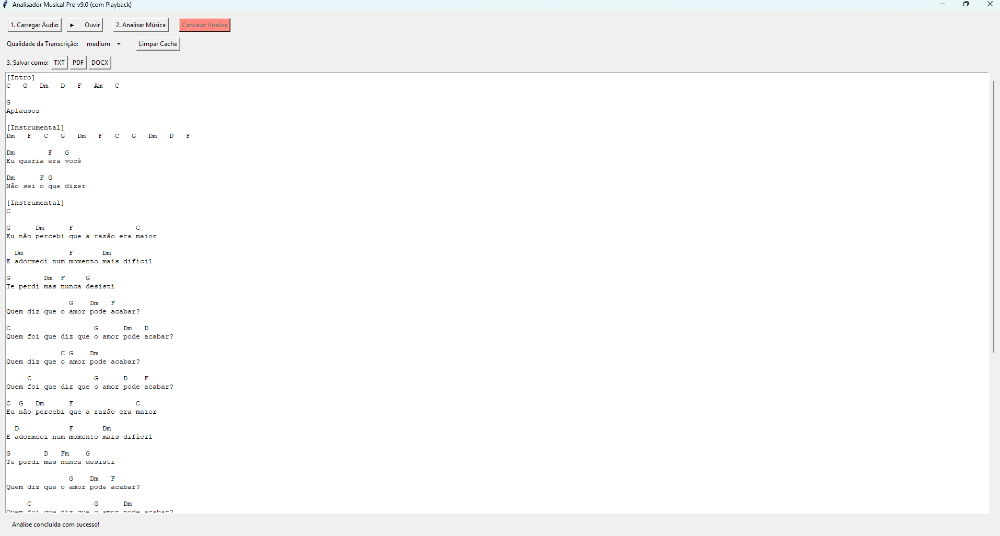

# Analisador Musical Pro v9.1

 

Uma aplicação de desktop robusta, desenvolvida em Python, que utiliza Inteligência Artificial para transcrever letras e extrair cifras de arquivos de áudio com alta precisão.




---

## ✨ Funcionalidades Principais

Este projeto foi desenvolvido com foco em robustez e máxima precisão, incorporando as seguintes funcionalidades:

* **Transcrição de Alta Precisão**: Utiliza `demucs` para realizar a separação de fontes e isolar os vocais da música antes de transcrevê-los com o modelo `medium` do OpenAI Whisper, garantindo uma letra muito mais fiel.
* **Reconhecimento de Cifras de Ponta**: Emprega a biblioteca `madmom` com seu pipeline mais avançado (CNN+CRF), uma referência acadêmica, para uma detecção de acordes com precisão profissional.
* **Alinhamento Inteligente**: Um algoritmo customizado alinha as cifras detectadas com as palavras transcritas com base em seus timestamps, posicionando-as corretamente no tempo.
* **Detecção de Partes Instrumentais**: O programa analisa e exibe as cifras de seções sem vocal, como `[Intro]`, `[Instrumental]` e `[Outro]`, oferecendo uma cifra completa da música.
* **Interface Gráfica Amigável e Responsiva**: Construída com Tkinter, a interface não trava durante o processamento graças ao uso de `threading`.
* **Controle Total para o Usuário**:
    * **Playback de Áudio**: Ouça o áudio carregado diretamente na aplicação antes de iniciar a análise.
    * **Seleção de Qualidade**: Escolha entre diferentes modelos do Whisper (`base`, `small`, `medium`) para balancear velocidade e precisão.
    * **Análise Cancelável**: Interrompa análises longas a qualquer momento com o botão "Cancelar".
* **Cache Inteligente**: Resultados de análises são salvos em uma pasta `.cache`. Reanalisar o mesmo arquivo é um processo instantâneo.
* **Exportação Múltipla**: Salve o resultado final nos formatos `.txt`, `.pdf` ou `.docx`.

---

## 🛠️ Tecnologias Utilizadas

* **Linguagem**: Python 3.10 / 3.11
* **Interface Gráfica**: Tkinter
* **Transcrição de Voz**: [OpenAI Whisper](https://github.com/openai/whisper)
* **Separação de Vocais**: [Demucs](https://github.com/facebookresearch/demucs)
* **Reconhecimento de Cifras**: [madmom](https://github.com/cpjku/madmom)
* **Manipulação de Áudio**: `sounddevice`, `soundfile`
* **Exportação**: `python-docx`, `fpdf2`, `Pillow`
* **Aceleração**: `PyTorch` (com suporte a CUDA para GPU) e `Numba`.

---

## 🚀 Guia de Instalação e Execução

### Pré-requisitos
1.  **Python**: Versão 3.10 ou 3.11. Durante a instalação no Windows, **marque a opção "Add Python to PATH"**.
2.  **Git**: Necessário para instalar algumas dependências. [Baixar Git](https://git-scm.com/downloads).
3.  **FFmpeg**: Dependência crítica para o processamento de áudio. Deve ser instalado e adicionado ao PATH do sistema operacional.

### Passos para Instalação
1.  **Clone este repositório:**
    ```bash
    git clone [https://github.com/seu-usuario/cifras_em_audios.git](https://github.com/seu-usuario/cifras_em_audios.git)
    cd cifras_em_audios
    ```

2.  **Crie e ative um ambiente virtual:**
    ```bash
    python -m venv venv
    .\venv\Scripts\activate
    ```

3.  **Instale as dependências:**
    * O arquivo `requirements.txt` está configurado para uma instalação baseada em CPU. Se você possui uma GPU NVIDIA, edite o arquivo para descomentar a linha do PyTorch para CUDA para uma performance muito superior.
    ```bash
    pip install -r requirements.txt
    ```
    *(Nota: A instalação pode demorar, pois as bibliotecas de IA são grandes)*

### Como Usar o Programa
1.  **Execute o programa:**
    ```bash
    python main.py
    ```
2.  Clique em **"1. Carregar Áudio"** para selecionar um arquivo de música.
3.  (Opcional) Na lista **"Qualidade da Transcrição"**, escolha um modelo (`medium` é o mais preciso, `base` é o mais rápido).
4.  (Opcional) Clique em **"▶️ Ouvir"** para pré-visualizar o áudio.
5.  Clique em **"2. Analisar Música"**. Aguarde o processamento.
    *(A primeira análise será bem mais lenta, pois os modelos de IA precisam ser baixados).*
6.  Após a conclusão, use os botões **"Salvar como..."** para exportar o resultado.

---

## 🔧 Como Funciona (Pipeline de Processamento)

O programa segue um fluxo de trabalho avançado para garantir a alta qualidade do resultado:

`Áudio Original` → `Demucs (Isola o Vocal)` → `Whisper (Transcreve o Vocal)` → `Madmom (Extrai Cifras do Áudio Original)` → `Formatter (Alinha Letra e Cifras)` → `Resultado Final`

---

## 📝 Licença

Este projeto está sob a licença MIT.

---

Feito por **[Jefferspn Felix]**
